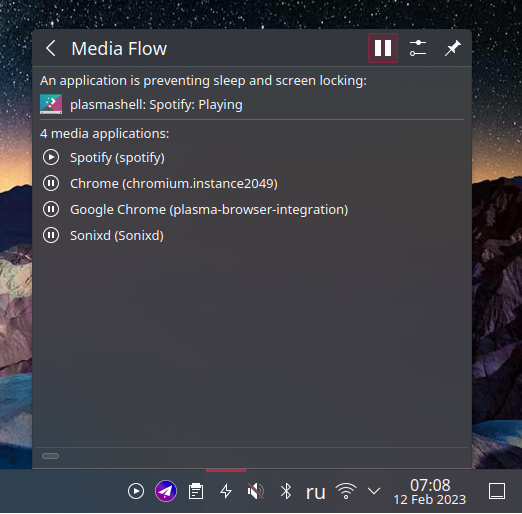

# Media Flow

Based on [pminhibition](https://github.com/popov895/pminhibition)

This KDE Plasma 5 applet let you see information about power management inhibition and media sources through mpris2. Also:

 - Auto pause feature (can be disabled): automatically pausing previous media player when another started playing.
 - Auto resume feature (can be disabled): automatically resume previous media player (which auto paused).
 - Spotify inhibition: preventing sleep when spotify is playing.

Available in the [KDE Store](https://store.kde.org/p/1986300).



Install:
```
    plasmapkg2 -i mediaflow.plasmoid
```
Remove:
```
    kpackagetool5 -t Plasma/Applet --remove org.kde.plasma.mediaflow
```
